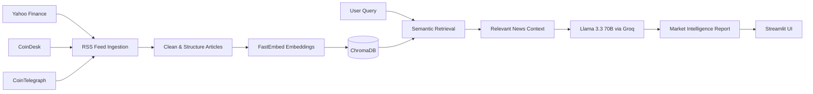

# 📰 MarketPulse AI

### Real-Time Financial News Intelligence with RAG, Llama 3.3 & Vector Search

MarketPulse AI is a **real-time financial news intelligence platform** that collects market and cryptocurrency news from RSS feeds, converts the content into searchable vector representations, retrieves the most relevant context for a user query, and uses **Llama 3.3 via Groq** to generate concise market intelligence reports.

The application combines **Retrieval-Augmented Generation (RAG), semantic search, vector databases, LLMs, and interactive analytics** in a single Streamlit application.

---

## ✨ Highlights

- 📰 **Live financial & crypto news ingestion** from Yahoo Finance, CoinDesk, and CoinTelegraph
- 🔎 **Semantic retrieval** using FastEmbed embeddings and ChromaDB
- 🤖 **RAG-powered market analysis** using Llama 3.3 70B through Groq
- 📊 **Interactive analytics** for article-source distribution and market sentiment
- 💬 **Natural-language market assistant** with preset queries and custom questions
- 🔗 **Source attribution** with retrieved article context shown to the user
- 📥 **Markdown report export** for generated intelligence reports
- ⚡ **Cached feed and vector-store operations** for a faster Streamlit experience

---

## 🖥️ Application Preview

<p align="center">
  
</p>

<p align="center">
  
</p>

---

## 🧠 How It Works



### RAG Pipeline

1. **Ingest** — fetch recent articles from configured RSS feeds.
2. **Clean** — remove HTML markup and normalize article summaries.
3. **Embed** — generate vector embeddings using `BAAI/bge-small-en-v1.5` through FastEmbed.
4. **Index** — store article documents and metadata in ChromaDB.
5. **Retrieve** — perform semantic retrieval for the user's question.
6. **Generate** — pass the retrieved context to Llama 3.3 70B through Groq.
7. **Present** — display an executive summary, market-impact outlook, key highlights, and retrieved sources.

---

## 🤖 AI Market Assistant

The RAG assistant supports questions such as:

- **Bitcoin Outlook** — latest Bitcoin-related news and outlook
- **Tech Stocks** — recent technology-stock updates
- **Crypto Regulations** — regulatory and legal developments
- **Market Sentiment** — overall sentiment across the indexed news
- **Custom Queries** — ask natural-language questions about the available market news

Generated reports follow a structured format:

> **Executive Summary** → **Market Impact (Bullish / Bearish / Neutral)** → **Key Highlights**

Retrieved documents can also be expanded in the UI so users can inspect the context used by the RAG pipeline.

---

## 📊 Dashboard Features

| Component | Purpose |
|---|---|
| **Live News Stream** | Browse recently ingested financial and crypto articles |
| **AI Market Assistant** | Ask natural-language questions over retrieved market context |
| **Source Distribution** | Visualize indexed articles by news source |
| **Market Sentiment Index** | Display the application's market sentiment dashboard indicator |
| **Report Export** | Download generated AI reports as Markdown files |

---

## 🛠️ Tech Stack

### AI / RAG
- **Llama 3.3 70B** — LLM for market intelligence generation
- **Groq API** — LLM inference
- **LangChain** — prompt and RAG orchestration
- **FastEmbed** — semantic embeddings
- **BAAI/bge-small-en-v1.5** — embedding model
- **ChromaDB** — vector storage and retrieval

### Data & Application
- **Python** — application and data-processing logic
- **Feedparser** — RSS feed ingestion
- **Pandas** — tabular data handling
- **Streamlit** — interactive web application
- **Plotly** — interactive analytics and visualizations

---

## 🚀 Getting Started

### Prerequisites

- Python 3.10+
- A **Groq API key**
- Internet access for live RSS feeds and Groq inference

### 1. Clone the repository

```bash
git clone https://github.com/shristhithapliyal-hub/MarketPulse-AI.git
cd MarketPulse-AI
```

### 2. Create a virtual environment

**Windows:**

```bash
python -m venv .venv
.venv\Scripts\activate
```

**macOS / Linux:**

```bash
python3 -m venv .venv
source .venv/bin/activate
```

### 3. Install dependencies

```bash
pip install -r requirements.txt
```

### 4. Configure the Groq API key

Create a `.env` file in the project root:

```env
GROQ_API_KEY=your_groq_api_key_here
```

Alternatively, the application allows the API key to be entered securely through the Streamlit sidebar.

> **Security:** Never commit your API key or `.env` file to GitHub.

### 5. Run the application

```bash
streamlit run app.py
```

The application will open in your browser through the local Streamlit server.

---

## 📁 Project Structure

```text
MarketPulse-AI/
├── app.py              # Streamlit application and RAG pipeline
├── requirements.txt    # Python dependencies
├── .gitignore          # Ignored local/configuration files
└── README.md           # Project documentation
```

---

## 🔐 Configuration

The application currently uses the following environment variable:

| Variable | Required | Description |
|---|---|---|
| `GROQ_API_KEY` | Yes | API key used for Llama 3.3 inference through Groq |

The API key can also be supplied through the application's password-protected sidebar input.

---

## 📌 Data Sources

MarketPulse AI currently ingests RSS content from:

- **Yahoo Finance** — financial market news
- **CoinDesk** — cryptocurrency and digital-asset news
- **CoinTelegraph** — cryptocurrency and blockchain news

The application processes the latest available entries from each configured feed at runtime.

---

## 🎯 Engineering Focus

This project demonstrates practical implementation of:

- Retrieval-Augmented Generation (RAG)
- Semantic search and vector retrieval
- LLM application development
- Prompt engineering and structured outputs
- Real-time RSS data ingestion
- Vector database integration
- Interactive data visualization
- API-based LLM inference
- Streamlit application development
- Environment-based secret management

---

## 🔮 Future Improvements

- [ ] Add additional financial news and market-data providers
- [ ] Replace the current dashboard sentiment indicator with dynamically computed sentiment scores
- [ ] Add ticker-level filtering and watchlists
- [ ] Persist vector collections across application restarts
- [ ] Add historical sentiment and market-trend tracking
- [ ] Add automated evaluation for RAG retrieval quality and response grounding
- [ ] Add unit tests and CI checks

---

## ⚠️ Disclaimer

MarketPulse AI is an **educational and technical demonstration project**. Its generated insights are based on retrieved news content and should **not be considered financial advice or investment recommendations**.

---

## 👩‍💻 Author

**Shristhi Thapliyal**  
M.Sc. Data Science | Python | SQL | AI/ML | Data Analytics

- GitHub: [@shristhithapliyal-hub](https://github.com/shristhithapliyal-hub)

---

## ⭐ Support

If you find the project useful, consider giving the repository a ⭐ on GitHub.
